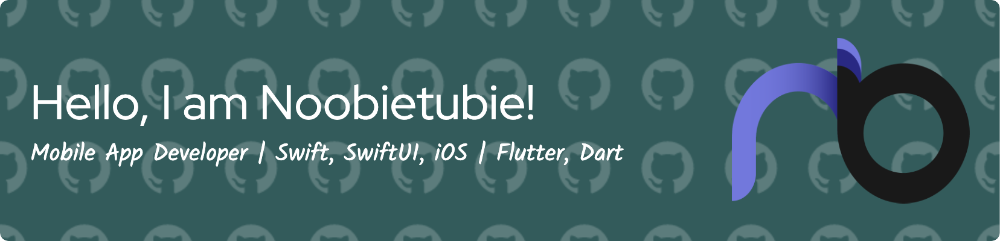

- 👋 Hi, I’m Noobietubie!
- 👀 I am a Mobile App Developer.
- 🌱 I specialize in Flutter/Dart/Swift(UIKit)/SwiftUI.
- 💞️ I’m looking for employment as a Junior iOS or Flutter Developer!
- 📫 How to reach me: treasure3210@gmail.com

# Blog posts

<!-- BLOG-POST-LIST:START -->
- [[LeetCode in Swift] Two Sum](https://medium.com/@treasure3210/leetcode-in-swift-two-sum-7791bb410f23?source=rss-5573399ce9ee------2)
- [[LeetCode in Swift] Buddy Strings](https://medium.com/@treasure3210/leetcode-in-swift-buddy-strings-d9b7e27bad98?source=rss-5573399ce9ee------2)
- [[LeetCode in Swift] Check if One String Swap Can Make Strings Equal](https://medium.com/@treasure3210/leetcode-in-swift-add-two-numbers-9fac2d76d28e?source=rss-5573399ce9ee------2)
- [[LeetCode in Swift] Add Two Numbers](https://medium.com/@treasure3210/leetcode-in-swift-add-two-numbers-84c358a804f7?source=rss-5573399ce9ee------2)
<!-- BLOG-POST-LIST:END -->

<h3 align="left">Connect with me:</h3>

<h3 align="left">Languages and Tools:</h3>

 

